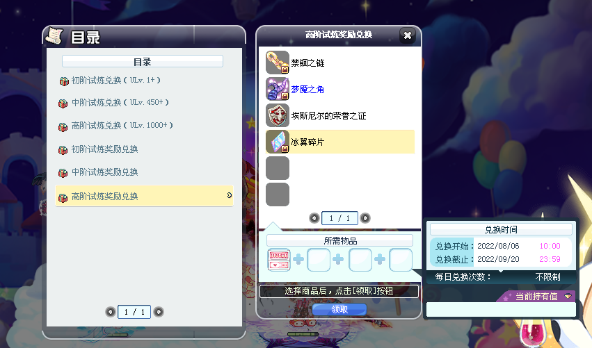

目前LABOOM版本已经全区实装，目前整合一些相关问题：
问：为什么我的圣域宝石词条消失了？
答：目前已经有官方答复为BUG，在下一次维护会进行修复，请不要重新打词条

问：野图改版后有什么福利吗？
答：目前已知福利为蝙蝠图鉴变得更容易获取（地下洞穴的野图，蝙蝠复活刷新会在平台上，不会到处刷新啦）

问：免费的永久超级飞翔石在哪里获取？
答：LABOOM版本已经对剧情主线任务进行了重置和重做，在剧情任务中的 Chapter.1→葩娜 →蓝色妖雀 中获取最基本的天空之飞翔石，在后面的剧情任务中会陆续获取到升级材料对该飞翔石进行升级，一直做到Chapter.3→圣域系列任务即可凑齐完升级到天空之超级飞翔石的材料

问：版本更新后有什么福利吗？
答：8月6日~9月10日，在活动界面中查找龙猫查理的试炼，到达彩虹游乐场（黑夜），龙猫理查已开启每日试炼，初级/中级/高级任务每日各能完成一次
其中初级任务请选择宝石丛林或地下祭坛，可获得6个初级兑换券
中级任务请选择冰封雪域或奈落之屋，可获得6个中级兑换券
高级任务请选择回声泉，可获得9个高级兑换券
高级任务等级不够2000级的请选择玫瑰庭院，可获得8个高级兑换券
兑换券可以兑换副本相关材料，有兴趣的可以积极参加

问：版本更新后我需要注意什么吗？
答：超越栏中的部分等级进行了扩张，可以根据自身拥有的超越点进行调整，加快副本进程

问：主职业觉醒完成任务的过程中有什么需要注意的吗？
答：请不要在进行觉醒任务过程中进行主职业/副职业的切换，会直接重置掉你已经完成的所有进度（已知是BUG，副职业做完转为主职业也会被清空进度）

问：更新后游戏框怎么是全屏？
答：游戏的默认解析度已经改为1920*1080，可以改为1366*768，和原来的最大框差不多

问：为什么我现在的面板最小多这么多？
答：技能【生存本能】进行了加强，最小从+2000%提升到+5000%

问：减伤药兑换没了怎么办？
答：希望的碎片已经变为可以交易和存仓，请不要出售，16级炼金生活技能可以制作无期限的相同的减伤药（并且可以重叠到999，不会再像以前一样一个格子只能放一瓶了）

问：剧情任务中 Chapter.1→瓦纳海姆 →再会，图里面没有代勒无法完成任务怎么办？
答：创建一个小号（或者连体），把任务获得的沙雅的戒指拿过来，技能栏里会有传送到华纳海姆的技能，传送过去跳到代勒那里进行触发（剧情任务账号共享）

问：剧情任务有必要做吗？
答：非常有必要！任务中增加了很多靠谱实用的奖励，其中比较重要的是永久的超级飞翔石，以及之前已经完成了玫瑰摇篮的彩蛋任务的，LABOOM更新后把任务重置整合在一起为新的剧情任务了，可以重复再做一次重复获取一套噩梦武器的材料

问：版本更新后外交更新了吗？
答：限时外交人物全体上线，辛卓（超能重置之书）、巴拉斯（太阳神地下祭坛图鉴）、乌尔（宝石丛林图鉴和军团武器）记得每天进行外交

